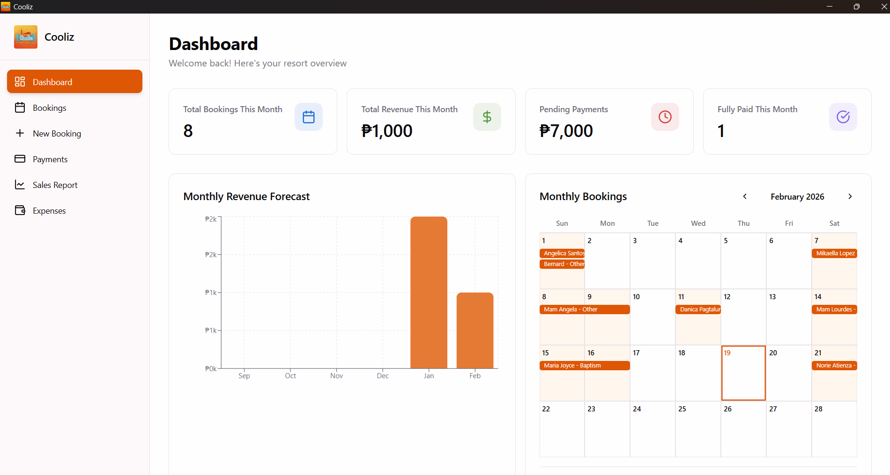
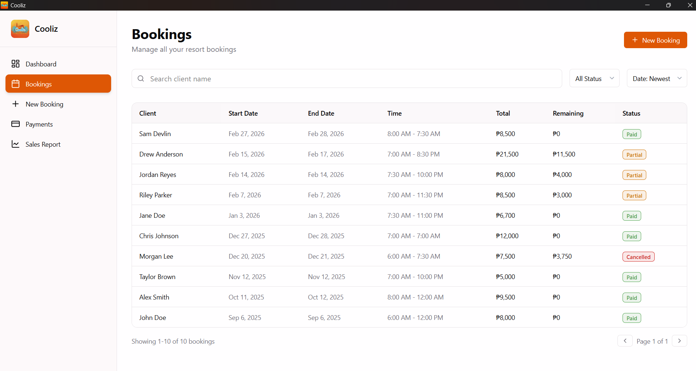
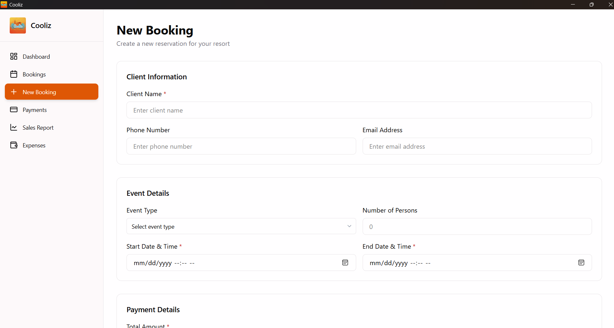
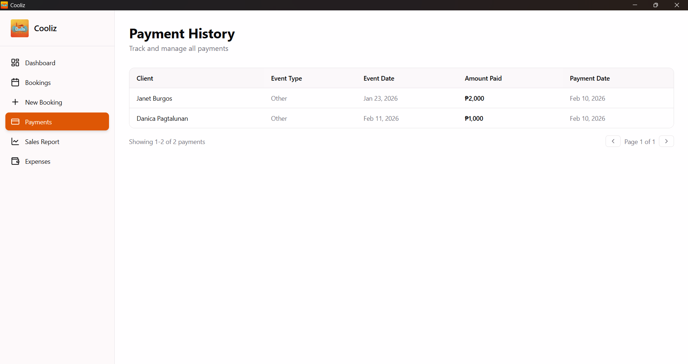
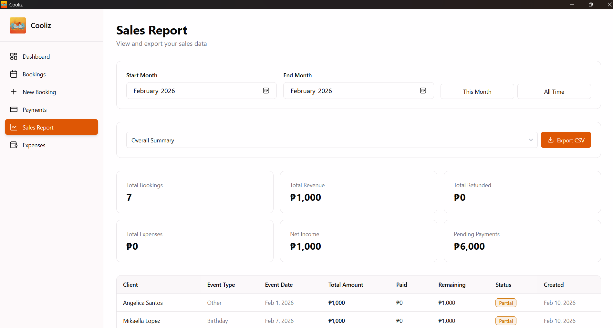
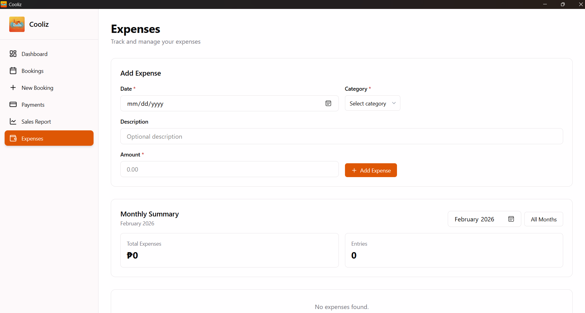

<div align="center">

<h1>Cooliz</h1>

A desktop app for managing bookings at [Cooliz](https://www.facebook.com/resort.cooliz/) resort.

</div>

## Features

- **Dashboard** — Overview with stats, calendar, revenue chart, and upcoming bookings
- **Bookings** — List all bookings with search, status, and date filter
- **Booking detail** — View and edit a booking, add payments, or cancel booking
- **New booking** — Create a new booking
- **Payments** — View and manage payments
- **Sales report** — Revenue and payment reports
- **Expenses** — Track and manage expenses

## Screenshots












## Download

You can download the latest version from the [releases page](https://github.com/alexgalicio/cooliz/releases)

## Prerequisites

- [Node.js](https://nodejs.org/)
- [Rust](https://www.rust-lang.org/tools/install)

Refer to the [Tauri documentation](https://v2.tauri.app/start/prerequisites/) for details on setting up the development environment prerequisites on different platforms.

## Getting Started

### 1. Clone the repository

```bash
git clone https://github.com/alexgalicio/cooliz.git
cd cooliz
```

### 2. Install Dependencies

```bash
npm install
```

### 3. Build for Development

```bash
npm run tauri dev
```

### 4. Build for Production

```bash
npm run tauri build
```
